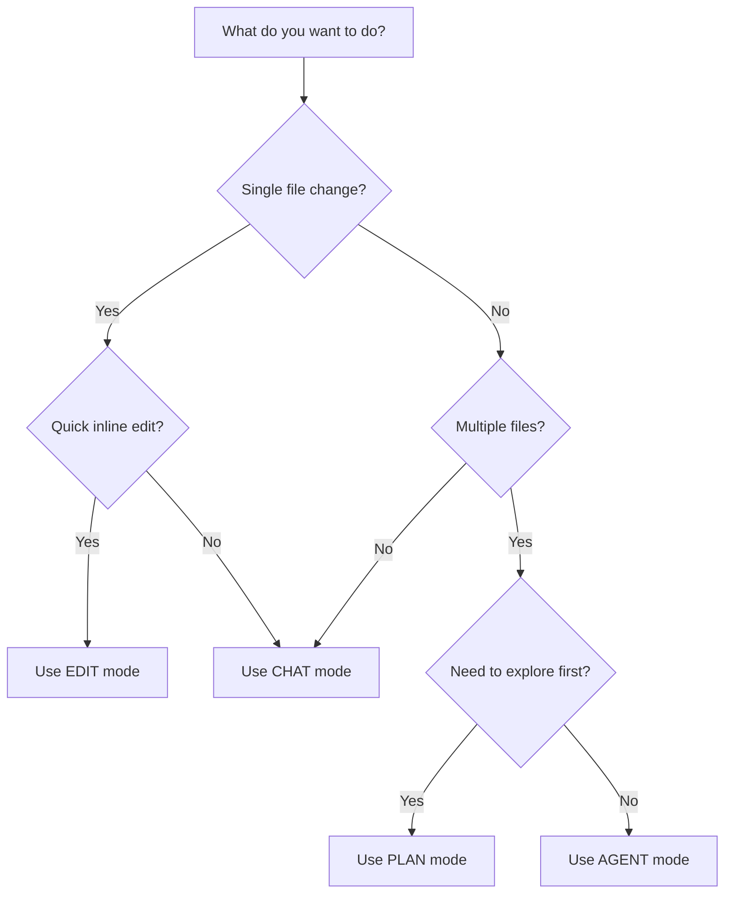

# Continue Documentation Improvement Plan

## Executive Summary

This plan transforms Continue's documentation from **feature-focused** to **problem-solving focused**, adds interactive elements, and provides users with actionable starter content they can immediately use.

---

## 🎯 Core Philosophy Shift

### Current State
Docs explain "what Continue can do" → Lists features and configurations

### Improved State
Docs solve "what problems users face" → Shows how Continue solves real development challenges

---

## 📊 Priority Matrix

### 🔴 HIGH PRIORITY (Immediate Impact)

#### 1. **Problem-Solving Landing Pages**
**Current:** Feature descriptions
**Improved:** Problem → Solution flow

**Example Structure:**
```
❌ OLD: "Agent equips Chat with tools for coding tasks"
✅ NEW: "Struggling with multi-file refactoring? Agent handles it end-to-end."
```

**Pages to Create:**
- `/workflows/debugging-guide` - "Fix bugs faster with AI"
- `/workflows/refactoring-guide` - "Safely refactor legacy code"
- `/workflows/testing-guide` - "Write comprehensive tests in minutes"
- `/workflows/documentation-guide` - "Auto-generate docs from code"
- `/workflows/code-review-guide` - "Get AI-powered code reviews"
- `/workflows/onboarding-guide` - "Understand unfamiliar codebases"

#### 2. **Interactive Task Runner** ⚡
**Problem:** Users read about features but don't know how to start
**Solution:** One-click executable tasks directly from docs

**Implementation:**
- Add "Try This Task" buttons in docs
- When user clicks, task loads directly into Continue
- Works for: Tasks, Workflows, MCP integrations
- Requires Continue connection detection

**Example:**
```mdx
<ContinueTask
  title="Fix Type Errors in Current File"
  prompt="Scan this file for TypeScript type errors and fix them"
  mode="agent"
  category="debugging"
/>
```

#### 3. **Starter Prompts Library** 📚
**Problem:** Blank canvas syndrome - users don't know what to ask
**Solution:** Curated library of proven prompts by use case

**Categories:**
- Debugging & Error Fixing
- Refactoring & Code Quality
- Testing & Test Generation
- Documentation Writing
- Performance Optimization
- Security Scanning
- Code Review & Analysis
- Learning & Understanding
- Migration & Updates

**Location:** `/starter-prompts/` section

#### 4. **Decision Trees & Flow Charts** 🌳
**Problem:** Users confused about which feature to use when
**Solution:** Visual decision guides

**Diagrams Needed:**
1. "Which mode should I use?" flowchart
   - When to use Chat vs Edit vs Agent vs Plan
2. "How to choose a model" decision tree
3. "Context provider selection guide"
4. "Hub vs Local assistant decision matrix"

---

### 🟡 MEDIUM PRIORITY (Quality of Life)

#### 5. **Real-World Scenarios Section**
**Problem:** Abstract examples don't show real value
**Solution:** Concrete, relatable scenarios

**Scenarios to Add:**
- "Migrating from React Class Components to Hooks"
- "Adding TypeScript to a JavaScript project"
- "Debugging a failing CI/CD pipeline"
- "Understanding a new team's codebase"
- "Refactoring a monolith to microservices"
- "Adding tests to legacy code"
- "Implementing OAuth authentication"
- "Optimizing slow database queries"

#### 6. **Before/After Code Examples**
**Problem:** Users can't visualize the transformation
**Solution:** Show actual transformations with diffs

**Examples in:**
- Edit mode demonstrations
- Agent workflow outcomes
- Refactoring guides
- Documentation generation

#### 7. **Video Walkthroughs** 🎥
**Problem:** Text doesn't convey the interactive experience
**Solution:** Short (<2 min) video demonstrations

**Videos Needed:**
- Quick Start (complete workflow)
- Each mode in action (4 videos)
- Complex Agent tasks
- Setting up Context providers
- Using Hub vs Local

#### 8. **Infographics** 📊

**Visuals to Create:**

1. **Continue Architecture Diagram**
   ```
   [Your IDE] ←→ [Continue Core] ←→ [AI Models]
                     ↓
              [Context Providers]
              [MCP Tools]
              [Hub]
   ```

2. **Feature Comparison Matrix**
   | Feature | Chat | Edit | Agent | Plan |
   |---------|------|------|-------|------|
   | Multi-file | ❌ | ❌ | ✅ | ✅ |
   | Read-only | N/A | ❌ | ❌ | ✅ |
   | Inline | ❌ | ✅ | ❌ | ❌ |

3. **Context Provider Map**
   Visual showing all 30+ context providers organized by category

4. **Agent Tools Capability Matrix**
   What each tool can do in Plan vs Agent mode

5. **Model Selection Guide**
   Visual guide for choosing models by use case and budget

---

### 🟢 LOW PRIORITY (Nice to Have)

#### 9. **Interactive Playground**
**Concept:** Embedded Continue instance in docs for trying features
**Technical Lift:** High
**Value:** Educational

#### 10. **Community Contributions Showcase**
**Content:** Real examples from users
**Format:** Case studies, custom blocks, success stories

#### 11. **Troubleshooting Wizard**
**Interactive:** Step-by-step diagnosis
**Reduces:** Support burden

---

## 🚀 New Documentation Pages

### Workflows Section (NEW)

```
/workflows/
  ├── overview.mdx               # "Solve These Problems with Continue"
  ├── debugging/
  │   ├── fix-runtime-errors.mdx
  │   ├── debug-test-failures.mdx
  │   ├── trace-stack-traces.mdx
  │   └── performance-profiling.mdx
  ├── refactoring/
  │   ├── rename-variables.mdx
  │   ├── extract-functions.mdx
  │   ├── modernize-code.mdx
  │   └── remove-duplicates.mdx
  ├── testing/
  │   ├── generate-unit-tests.mdx
  │   ├── generate-integration-tests.mdx
  │   ├── improve-coverage.mdx
  │   └── test-edge-cases.mdx
  ├── documentation/
  │   ├── generate-docstrings.mdx
  │   ├── create-readme.mdx
  │   ├── api-documentation.mdx
  │   └── inline-comments.mdx
  ├── learning/
  │   ├── understand-codebase.mdx
  │   ├── explain-complex-code.mdx
  │   ├── learn-framework.mdx
  │   └── review-pull-request.mdx
  └── migration/
      ├── language-migration.mdx
      ├── framework-upgrade.mdx
      └── dependency-updates.mdx
```

### Starter Prompts Section (NEW)

```
/starter-prompts/
  ├── overview.mdx               # Searchable library
  ├── debugging.mdx              # 20+ debugging prompts
  ├── refactoring.mdx            # 20+ refactoring prompts
  ├── testing.mdx                # 20+ testing prompts
  ├── documentation.mdx          # 15+ doc prompts
  ├── security.mdx               # 10+ security prompts
  ├── performance.mdx            # 10+ performance prompts
  └── learning.mdx               # 15+ learning prompts
```

### Quick Wins Section (NEW)

```
/quick-wins/
  ├── overview.mdx               # "10 Things You Can Do Right Now"
  ├── 5-minute-tasks.mdx         # Tasks that take <5 minutes
  ├── 15-minute-workflows.mdx    # Workflows that take <15 minutes
  └── daily-dev-tasks.mdx        # Common daily tasks
```

---

## 📝 Sample Starter Prompts

### Debugging Category

1. **Fix Type Errors**
   ```
   Scan this file for TypeScript type errors and fix them. Add proper type annotations where missing.
   ```

2. **Debug Failing Test**
   ```
   This test is failing. Analyze the error, identify the root cause, and fix the implementation.
   ```

3. **Trace Performance Issue**
   ```
   Profile this function and identify performance bottlenecks. Suggest optimizations.
   ```

### Refactoring Category

4. **Extract Reusable Function**
   ```
   Find repeated code patterns in this file and extract them into reusable functions.
   ```

5. **Modernize JavaScript**
   ```
   Update this code to use modern JavaScript features (ES6+). Replace callbacks with async/await.
   ```

6. **Simplify Complex Function**
   ```
   This function is too complex. Refactor it into smaller, more maintainable pieces.
   ```

### Testing Category

7. **Generate Unit Tests**
   ```
   Write comprehensive unit tests for this module using Jest. Cover edge cases and error conditions.
   ```

8. **Add Integration Tests**
   ```
   Create integration tests for this API endpoint. Test success, error, and edge cases.
   ```

9. **Improve Test Coverage**
   ```
   Analyze test coverage and add tests for uncovered code paths.
   ```

### Documentation Category

10. **Generate README**
    ```
    Create a comprehensive README.md for this project. Include setup, usage, and examples.
    ```

11. **Add Inline Docs**
    ```
    Add clear, concise comments explaining what this code does and why.
    ```

12. **Create API Docs**
    ```
    Generate API documentation for all public functions in this module.
    ```

### Learning Category

13. **Explain Complex Code**
    ```
    Explain what this code does step-by-step. Use simple language and examples.
    ```

14. **Understand Architecture**
    ```
    Explain the architecture of this module. How do the components interact?
    ```

15. **Review Pull Request**
    ```
    Review this PR. Check for bugs, performance issues, and best practices.
    ```

---

## 🎨 Infographic Specifications

### 1. Continue Mode Selector Flowchart



### 2. Context Provider Ecosystem Map

```
Code Context          Development Data        External Sources
├─ @File             ├─ @Terminal            ├─ @Docs
├─ @Folder           ├─ @Diff                ├─ @URL
├─ @Codebase         ├─ @Commits             ├─ @Web
├─ @Open             ├─ @Problems            ├─ @Google
├─ @CurrentFile      ├─ @Issue               └─ @HTTP
└─ @Code             ├─ @GitLab-MR
                     └─ @Jira                Database
                                             ├─ @PostgreSQL
IDE Integration      Utilities               ├─ @MySQL
├─ @Clipboard        ├─ @RepoMap             └─ @SQLite
├─ @Debugger         ├─ @Search
├─ @Tree             └─ @MCP                 AI Tools
└─ @OS                                       └─ Custom MCP Servers
```

### 3. Agent Tools Capability Matrix

| Tool | Plan Mode | Agent Mode | Use Case |
|------|-----------|------------|----------|
| `read_file` | ✅ | ✅ | View file contents |
| `edit_file` | ❌ | ✅ | Modify existing files |
| `create_new_file` | ❌ | ✅ | Create new files |
| `run_terminal_command` | ❌ | ✅ | Execute shell commands |
| `grep_search` | ✅ | ✅ | Search code patterns |
| `view_repo_map` | ✅ | ✅ | Understand structure |

---

## 🔧 Interactive Task Runner Implementation

### Technical Design

**Component: `ContinueTask.tsx`**
```tsx
interface ContinueTaskProps {
  title: string;
  prompt: string;
  mode: 'chat' | 'agent' | 'plan' | 'edit';
  description?: string;
  category?: string;
  estimatedTime?: string;
  difficulty?: 'beginner' | 'intermediate' | 'advanced';
  prerequisites?: string[];
}
```

**Features:**
- ✅ Detect if Continue is installed/connected
- ✅ One-click to run task in Continue
- ✅ Show task details (time, difficulty, prerequisites)
- ✅ Track usage analytics (what tasks are popular)
- ✅ Copy prompt to clipboard if not connected
- ✅ Filter by category, difficulty, time

**User Flow:**
1. User reads workflow documentation
2. Sees "Try This Task" button
3. Clicks button
4. If Continue connected: Task opens in Continue
5. If not connected: Prompt copies to clipboard + install CTA

### Example Usage in Docs

```mdx
## Fix TypeScript Errors

Struggling with type errors? Let Continue analyze and fix them for you.

<ContinueTask
  title="Fix All TypeScript Type Errors"
  prompt="Scan this project for TypeScript type errors. Fix each one and explain what was wrong."
  mode="agent"
  category="debugging"
  estimatedTime="2-5 minutes"
  difficulty="beginner"
  prerequisites={["TypeScript project open in IDE"]}
/>

### What This Task Does:
1. Scans your project for type errors
2. Identifies root causes
3. Applies fixes automatically
4. Explains each fix

### Expected Outcome:
- All type errors resolved
- Proper type annotations added
- Type safety improved
```

---

## 📦 Deliverables

### Phase 1: Content Restructuring (Week 1-2)
- ✅ Create Workflows section
- ✅ Create Starter Prompts library
- ✅ Rewrite landing pages with problem-solving focus
- ✅ Add decision flowcharts

### Phase 2: Interactive Features (Week 3-4)
- ✅ Implement ContinueTask component
- ✅ Add task buttons to relevant docs
- ✅ Create task catalog
- ✅ Add connection detection

### Phase 3: Visual Enhancements (Week 5-6)
- ✅ Create infographics
- ✅ Add architecture diagrams
- ✅ Record video walkthroughs
- ✅ Add before/after code examples

### Phase 4: Real-World Content (Week 7-8)
- ✅ Write scenario-based guides
- ✅ Add case studies
- ✅ Create migration guides
- ✅ Add troubleshooting wizard

---

## 📈 Success Metrics

**User Engagement:**
- Time to first successful task (reduce by 50%)
- Task completion rate (increase to 80%+)
- Return user rate (increase by 40%)

**Content Effectiveness:**
- Docs search success rate
- User feedback ratings
- Support ticket reduction (target: -30%)

**Feature Discovery:**
- % users who try Agent mode
- % users who use Context providers
- % users who create custom blocks

---

## 🎓 Content Principles

### 1. **Start with the Pain**
Every page begins with the problem, not the solution.

❌ "Continue has 4 modes: Chat, Edit, Agent, Plan"
✅ "Tired of context-switching between your IDE and ChatGPT?"

### 2. **Show, Don't Tell**
Use concrete examples, not abstractions.

❌ "Agent can handle complex multi-step tasks"
✅ "Watch Agent refactor 15 files, run tests, and fix errors—all from one prompt"

### 3. **Progressive Disclosure**
Quick Start → Common Patterns → Advanced Customization

### 4. **Actionable Outcomes**
Every guide ends with "You can now..." statements.

### 5. **Copy-Paste Ready**
All examples should be immediately usable.

---

## 🚦 Implementation Priority

### This Week
1. ✅ Create starter prompts library (100+ prompts)
2. ✅ Add workflows section structure
3. ✅ Create decision flowcharts
4. ✅ Rewrite index and overview pages

### Next Week
5. ✅ Implement ContinueTask component
6. ✅ Add interactive task buttons
7. ✅ Create infographics
8. ✅ Record quick videos

### Following Weeks
9. ✅ Write scenario guides
10. ✅ Add before/after examples
11. ✅ Create troubleshooting wizard
12. ✅ User testing and iteration

---

## 💡 Innovation Ideas

### "Continue in 60 Seconds"
Interactive tutorial that gets users to success in <1 minute.

### "Prompt Playground"
Test and refine prompts before using them in your project.

### "Workflow Templates"
Pre-built multi-step workflows users can customize.

### "AI Pair Programming Sessions"
Live examples of developers solving real problems with Continue.

### "Quick Wins Checklist"
10 tasks every new user should complete to understand Continue's value.

---

## 📞 Feedback Loop

### Community Sourcing
- Monthly "What workflow do you want?" surveys
- Featured community prompts
- User-submitted scenarios

### Analytics Integration
- Track which prompts are most copied
- Identify drop-off points in tutorials
- A/B test different approaches

### Continuous Improvement
- Weekly docs update cycle
- Monthly content retrospectives
- Quarterly major refreshes

---

## ✅ Next Steps

1. **Review** this plan with team
2. **Prioritize** based on resources
3. **Create** starter prompts library (quick win)
4. **Prototype** ContinueTask component
5. **Draft** first 3 workflow guides
6. **Design** key infographics
7. **Test** with users
8. **Iterate** based on feedback

---

**Questions? Feedback? Let's discuss! 🚀**
