## 🎯 Which Mode Should I Use?

<Info>
Use this flowchart to decide between Chat, Edit, Agent, and Plan modes.
</Info>

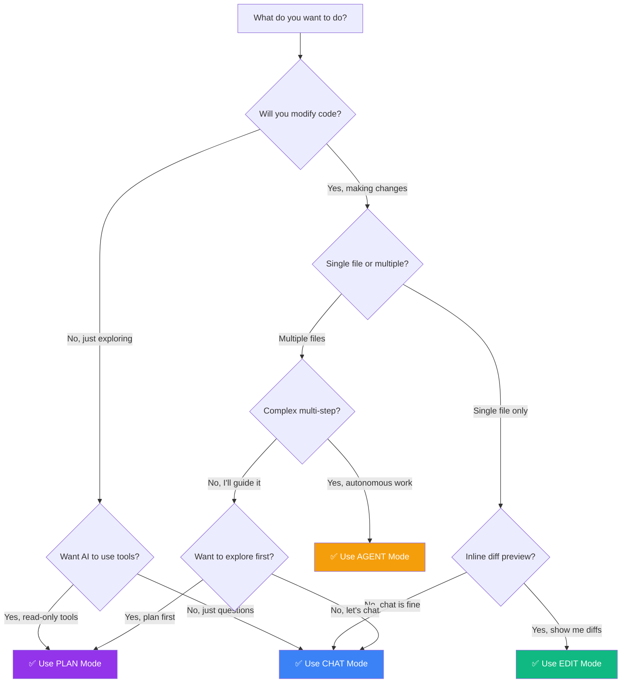

---

## 🤖 Mode Comparison Matrix

| Feature | Chat | Edit | Agent | Plan |
|---------|------|------|-------|------|
| **Answer Questions** | ✅ Primary | ❌ No | ✅ Yes | ✅ Yes |
| **Read Files** | ✅ Yes | ⚠️ Current only | ✅ Yes | ✅ Yes |
| **Modify Files** | ⚠️ Via apply | ✅ Primary | ✅ Yes | ❌ Read-only |
| **Create Files** | ❌ No | ❌ No | ✅ Yes | ❌ Read-only |
| **Run Commands** | ❌ No | ❌ No | ✅ Yes | ❌ Read-only |
| **Multi-Step Tasks** | ⚠️ Manual | ❌ No | ✅ Autonomous | ✅ Planning |
| **Inline Diff** | ❌ No | ✅ Yes | ❌ No | ❌ No |
| **Safe Exploration** | ✅ Yes | ❌ Makes changes | ❌ Makes changes | ✅ Read-only |
| **Context Providers** | ✅ 30+ | ✅ Available | ✅ 30+ | ✅ 30+ |
| **Best For** | Questions, explanations | Quick edits, refactoring | Complex tasks, automation | Exploring, planning |

---

## 🧭 Task-to-Mode Mapping

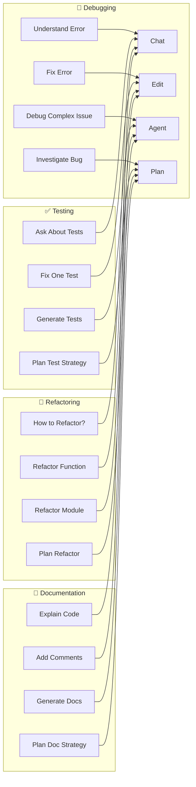

---

## 🎓 When to Use Each Mode

### 💬 Use CHAT when:

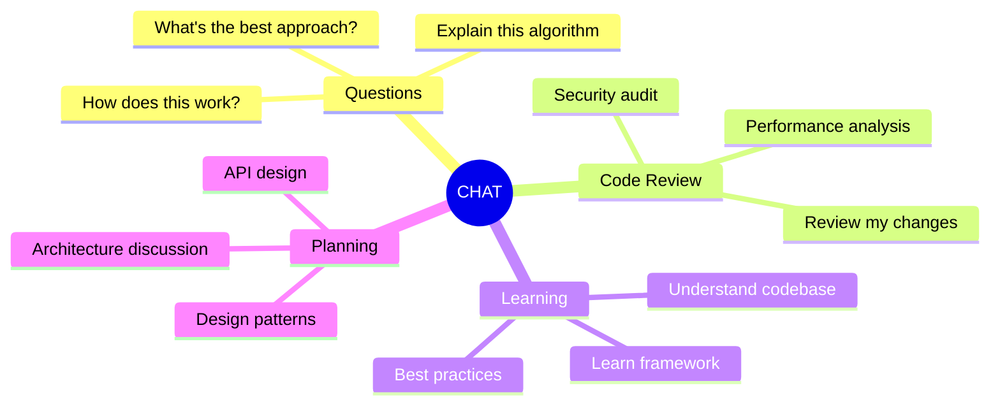

**Real Examples:**
- "Explain what this function does"
- "Review this PR for security issues"
- "What's the best way to handle errors here?"
- "Help me understand this architecture"

---

### ✏️ Use EDIT when:

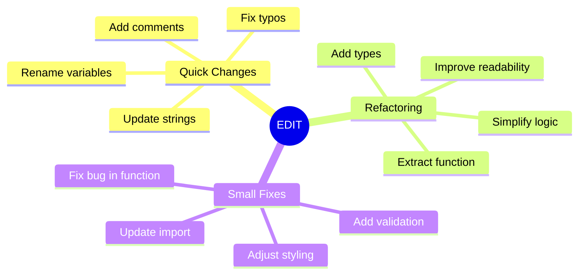

**Real Examples:**
- "Add JSDoc comments to this function"
- "Refactor this to use async/await"
- "Fix the type error on line 42"
- "Extract this repeated code into a utility"

---

### 🤖 Use AGENT when:

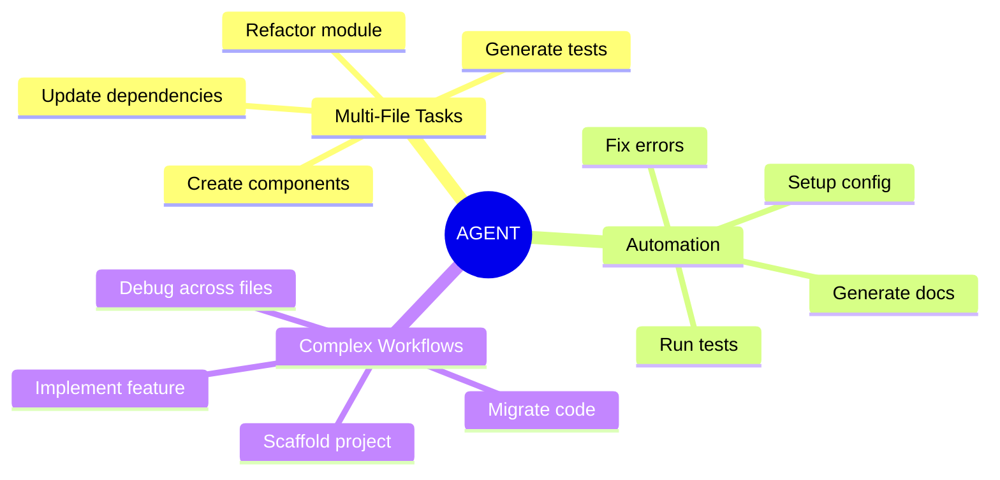

**Real Examples:**
- "Generate unit tests for all functions in this module"
- "Implement user authentication with JWT"
- "Migrate all class components to functional components"
- "Create a new API endpoint with tests and docs"

---

### 🔍 Use PLAN when:

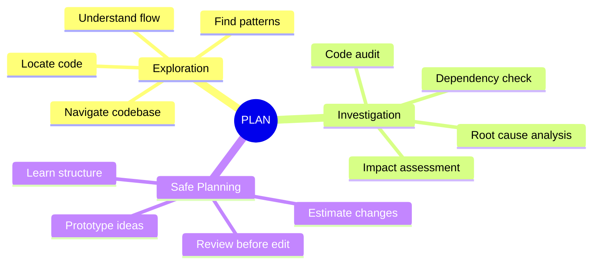

**Real Examples:**
- "Show me how authentication works in this app"
- "Find all places where this API is called"
- "What would break if I change this interface?"
- "Help me understand the data flow"

---

## 🧩 Context Provider Selection Guide

```mermaid
graph TD
    Start[What context do you need?] --> Type{Context Type?}

    Type -->|Code| CodeContext
    Type -->|Development| DevContext
    Type -->|External| ExternalContext
    Type -->|IDE| IDEContext

    CodeContext --> C1[@File - Specific files]
    CodeContext --> C2[@Folder - Directory contents]
    CodeContext --> C3[@Codebase - Search codebase]
    CodeContext --> C4[@Code - Highlighted selection]

    DevContext --> D1[@Terminal - Command output]
    DevContext --> D2[@Diff - Recent changes]
    DevContext --> D3[@Commits - Git history]
    DevContext --> D4[@Problems - IDE errors]

    ExternalContext --> E1[@Docs - Documentation]
    ExternalContext --> E2[@URL - Web pages]
    ExternalContext --> E3[@Database - DB queries]
    ExternalContext --> E4[@MCP - Custom tools]

    IDEContext --> I1[@CurrentFile - Active file]
    IDEContext --> I2[@Clipboard - Copied text]
    IDEContext --> I3[@Debugger - Debug info]
    IDEContext --> I4[@Open - All open files]

    style C1 fill:#3B82F6,color:#fff
    style C2 fill:#3B82F6,color:#fff
    style C3 fill:#3B82F6,color:#fff
    style C4 fill:#3B82F6,color:#fff

    style D1 fill:#10B981,color:#fff
    style D2 fill:#10B981,color:#fff
    style D3 fill:#10B981,color:#fff
    style D4 fill:#10B981,color:#fff

    style E1 fill:#F59E0B,color:#fff
    style E2 fill:#F59E0B,color:#fff
    style E3 fill:#F59E0B,color:#fff
    style E4 fill:#F59E0B,color:#fff

    style I1 fill:#9333EA,color:#fff
    style I2 fill:#9333EA,color:#fff
    style I3 fill:#9333EA,color:#fff
    style I4 fill:#9333EA,color:#fff
```

---

## 🏗️ Continue Architecture

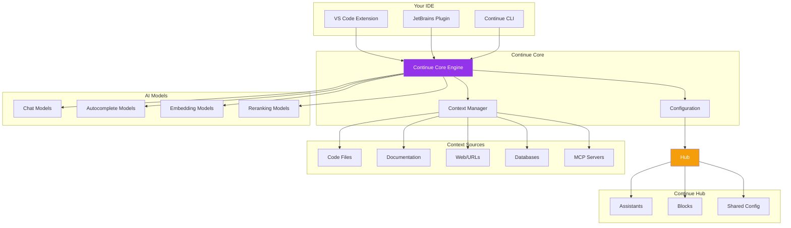

---

## 🎯 Model Selection Decision Tree

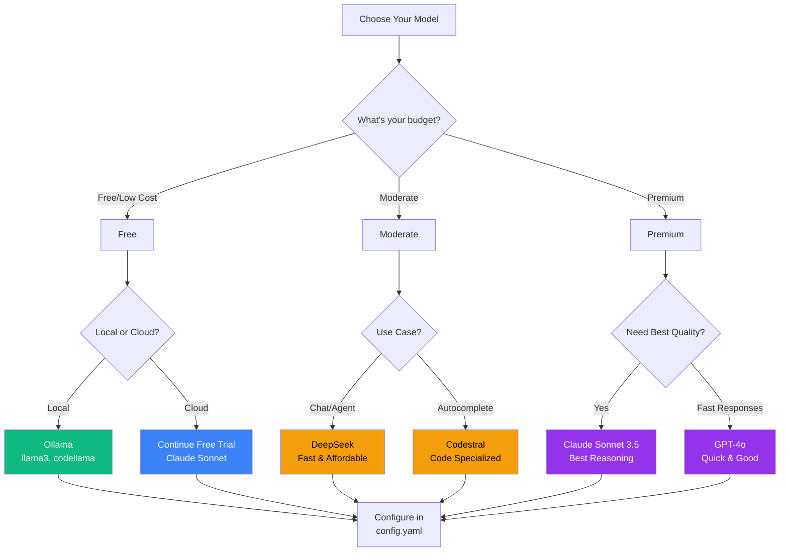

---

## 📊 Hub vs Local Assistant

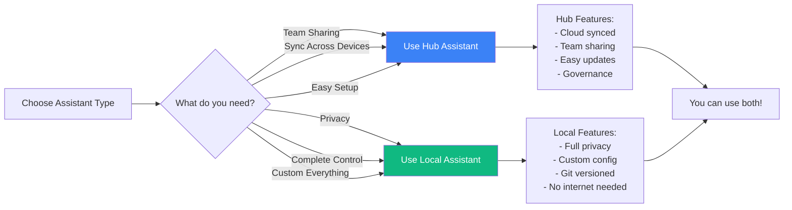

---

## 🔄 Development Workflow with Continue

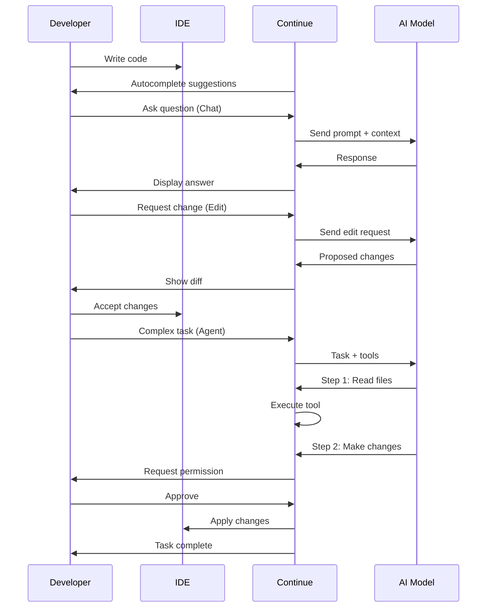

---

## 🎯 Quick Decision Matrix

### By Time Available

| Time | Recommended Mode | Why |
|------|-----------------|-----|
| < 30 seconds | **Autocomplete** | Get inline suggestions as you type |
| 30 sec - 2 min | **Chat** | Quick questions and explanations |
| 2 - 5 min | **Edit** | Fast targeted changes to single file |
| 5 - 15 min | **Agent** | Multi-step tasks, file creation, automation |
| 15+ min | **Plan then Agent** | Explore first, then execute |

### By Expertise Level

| Level | Start With | Why |
|-------|-----------|-----|
| **Beginner** | Chat + Edit | Learn with questions, make simple changes |
| **Intermediate** | All modes | Experiment with Agent for bigger tasks |
| **Advanced** | Plan + Agent | Efficient exploration and execution |

### By Safety Requirements

| Safety Need | Use Mode | Reason |
|-------------|---------|---------|
| **Read-only exploration** | Plan | Can't modify anything |
| **Review before changes** | Edit | Shows diff preview |
| **Reversible changes** | Any mode + Git | Can always revert |
| **Autonomous workflow** | Agent | Need to trust and review after |

---

## 📈 Complexity Scale

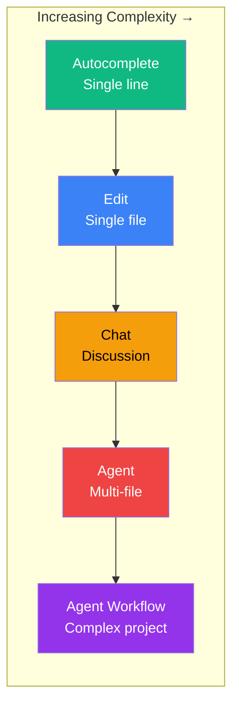

---

## 🔍 Context Provider Use Cases

### Code Context

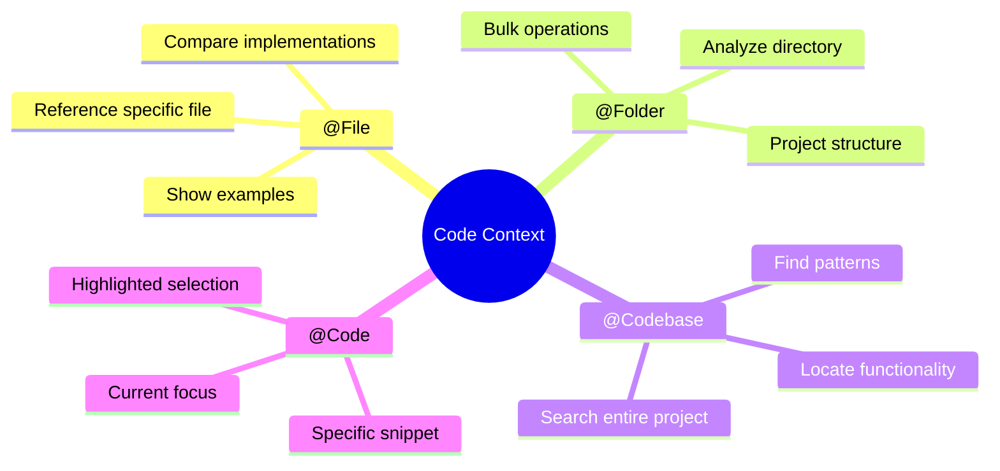

### Development Context

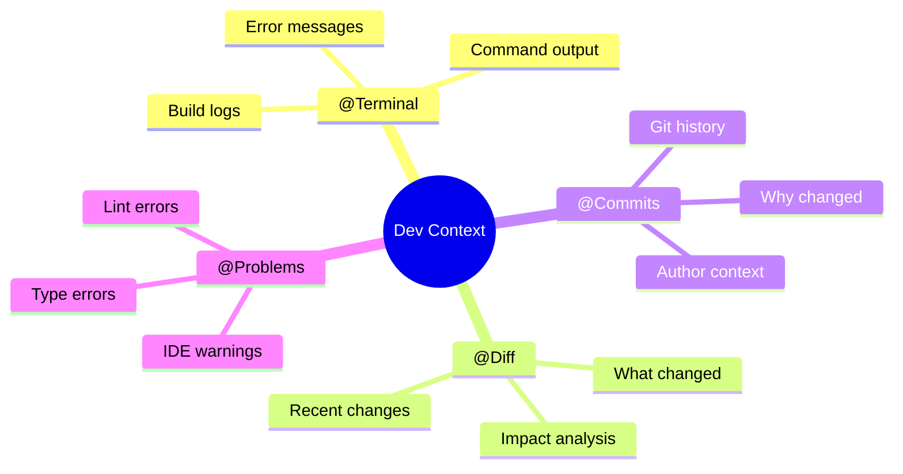

### External Context

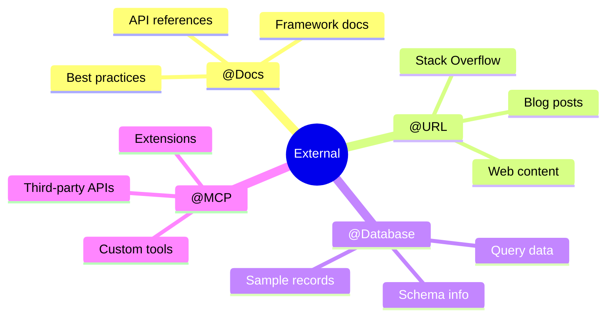

---

## 💡 Pro Tips

<AccordionGroup>
  <Accordion title="Combine Modes for Best Results">
    **Workflow:** Plan → Chat → Edit/Agent

    1. **Plan:** Explore and understand
    2. **Chat:** Discuss approach
    3. **Edit/Agent:** Implement changes

    This gives you safety + discussion + execution.
  </Accordion>

  <Accordion title="Start Small, Scale Up">
    - Begin with Chat for questions
    - Move to Edit for small changes
    - Graduate to Agent for complex tasks
    - Use Plan when you need safety

    Don't jump straight to Agent if you're new!
  </Accordion>

  <Accordion title="Layer Context Providers">
    Combine multiple context sources:

    ```
    Review this change: @Diff
    Considering: @Docs https://docs.example.com
    In context of: @Codebase similar patterns
    Against errors: @Problems
    ```

    More context = better results!
  </Accordion>
</AccordionGroup>

---

## 📚 Related Resources

<CardGroup cols={2}>
  <Card title="Features Overview" icon="star" href="/features">
    Detailed guide to each mode
  </Card>
  <Card title="Starter Prompts" icon="book-sparkles" href="/starter-prompts/overview">
    Ready-to-use prompts for each mode
  </Card>
  <Card title="Workflows" icon="diagram-project" href="/workflows/overview">
    Complete workflows combining modes
  </Card>
  <Card title="Context Providers" icon="layer-group" href="/customize/context/overview">
    Full list of context providers
  </Card>
</CardGroup>
